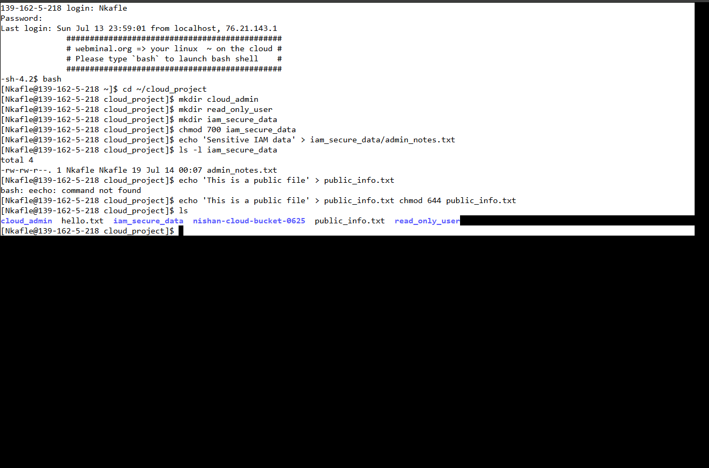

# Day 2 – IAM Simulation (Without sudo)

Created simulated IAM users using folders: `cloud_admin`, `read_only_user`  
Set up restricted access on folder: `iam_secure_data`  
Created `admin_notes.txt` (only owner can access)  
Created public read-only file: `public_info.txt`  
Used chmod to manage file/folder access like IAM policies

## Commands Used:
- mkdir
- chmod
- echo
- ls -l
- cp

## Reflection:
Even without root access, I was able to simulate IAM (Identity & Access Management) in Linux by controlling folder and file permissions. I have now better understand the principle of least privilege and how cloud systems manage access roles.

## Screenshot:

